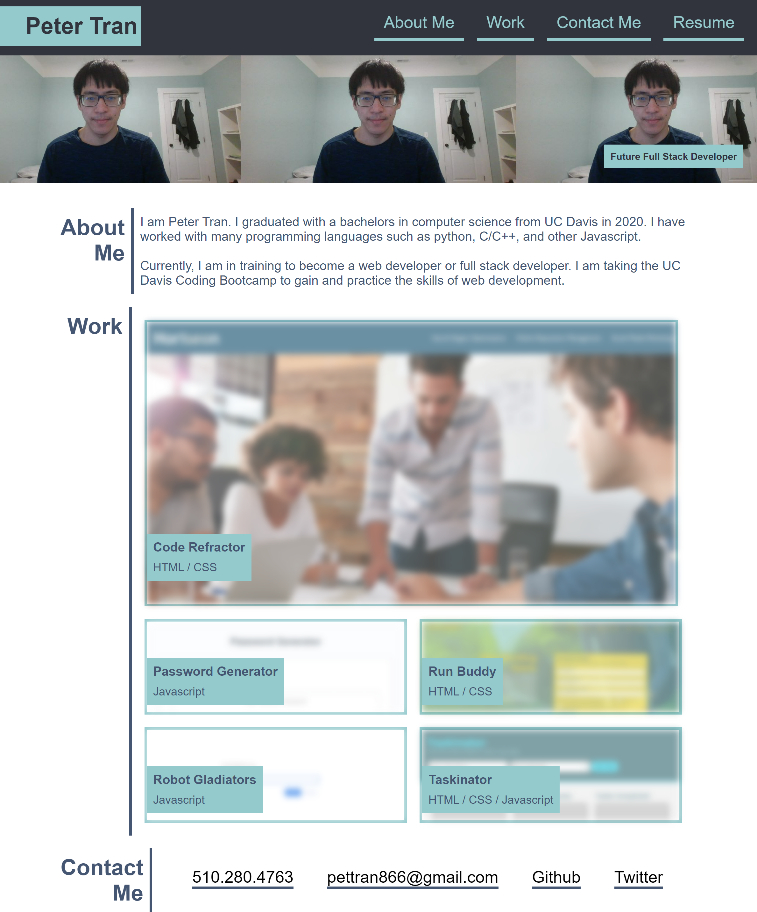

# Professional Portfolio

Build your own portfolio webpage showcasing your skills and work for employers to look.

---

## Table of Content

- [Outline](#outline)
  - [Header](#header)
  - [Hero](#hero)
  - [About Me](#about-me)
  - [Work](#work)
  - [Contact Me](#contact-me)
- [Animations](#animations)
- [Screenshot](#screenshoot)
- [Page Link](#page-link)

---

## Outline

The portfolio webpage consists of 5 sections: header, hero, about me, work, and contact me.

### Header

The header contains the developer's name and a navigation bar that scrolls down to a specific section when one their corresponding navigation tab are click.

### Hero

The hero has an image or portrait of the developer with a subtitle.

### About Me

The About Me section has information about the developer.

### Work

The work section showcases projects and applications the developer have work on. Additionally, clicking on the projects/applications should lead them to theier deployed sites.

### Contact Me

The Contact Me section has the contact information of the developer. Clicking on the contact information either leads them to send an email/phone call or send them to the another site that is either has their projects or social media.

---

## Animations

The webpage has animations on the navigation tabs and projects/applications.

- hovering the mouse over a navigation tab will highlight the tab
- hovering over a project will unblurred the project image

---

## Screenshot

---

## Page Link

Link: <a href="https://ptran77.github.io/professional-portfolio/">https://ptran77.github.io/professional-portfolio/</a>
